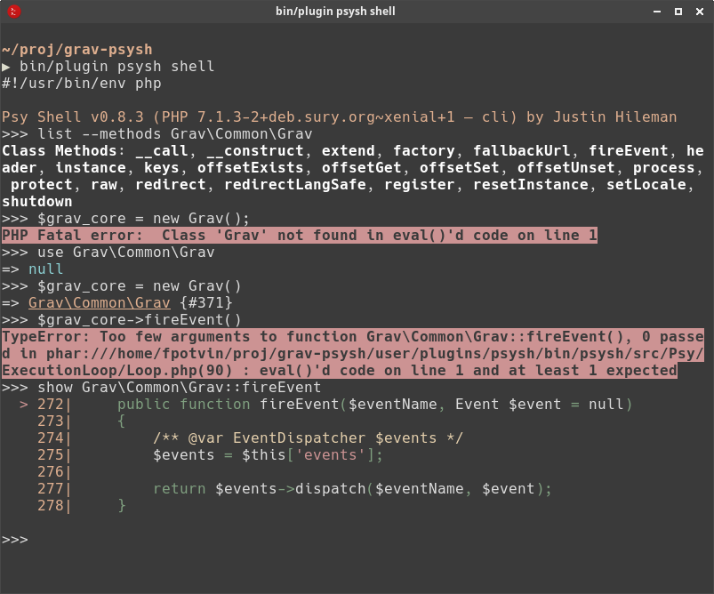

# Grav PsySH (PHP interactive shell) Plugin

This **PsySH plugin** for [Grav](http://github.com/getgrav/grav) provide a runtime developer console, interactive debugger and REPL for PHP.

Visit [PsySH](http://psysh.org/) homepage for full details.

# Install

`bin/gpm install psysh`

# Usage

Read [usage instructions](USAGE.md).

# Attribution

This plugin include the PsySH executable created and maintained by Justin Hileman at [github.com/bobthecow/psysh](https://github.com/bobthecow/psysh)
